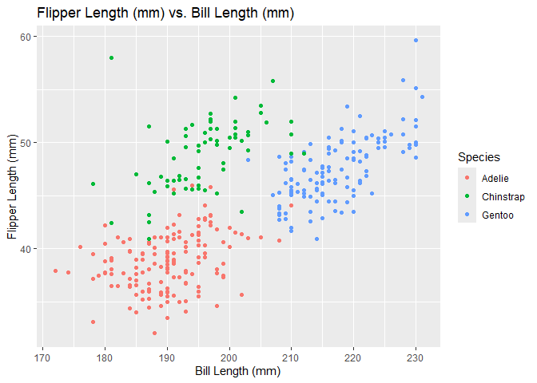

Data Science Homework 1
================
ak5357
2024-09-19

## Problem 1

**Loading the penguins dataset and getting a `glimpse` of it.**

``` r
data("penguins", package = "palmerpenguins")
glimpse(penguins)
```

    ## Rows: 344
    ## Columns: 8
    ## $ species           <fct> Adelie, Adelie, Adelie, Adelie, Adelie, Adelie, Adel…
    ## $ island            <fct> Torgersen, Torgersen, Torgersen, Torgersen, Torgerse…
    ## $ bill_length_mm    <dbl> 39.1, 39.5, 40.3, NA, 36.7, 39.3, 38.9, 39.2, 34.1, …
    ## $ bill_depth_mm     <dbl> 18.7, 17.4, 18.0, NA, 19.3, 20.6, 17.8, 19.6, 18.1, …
    ## $ flipper_length_mm <int> 181, 186, 195, NA, 193, 190, 181, 195, 193, 190, 186…
    ## $ body_mass_g       <int> 3750, 3800, 3250, NA, 3450, 3650, 3625, 4675, 3475, …
    ## $ sex               <fct> male, female, female, NA, female, male, female, male…
    ## $ year              <int> 2007, 2007, 2007, 2007, 2007, 2007, 2007, 2007, 2007…

**Describing the Data**

The `penguins` dataset has 344 rows and 8 columns, and contains
information about the attributes listed below.

| Variable       | Column Name       | Unit | Data Type | Values                    |
|----------------|-------------------|------|-----------|---------------------------|
| Species        | species           | N/A  | Factor    | Adelie, Chinstrap, Gentoo |
| Island         | island            | N/A  | Factor    | Biscoe, Dream, Torgersen  |
| Bill Length    | bill_length_mm    | mm   | Double    | *Range:* 32.1 to 59.6     |
| Bill Depth     | bill_depth_mm     | mm   | Double    | *Range:* 13.1 to 21.5     |
| Flipper Length | flipper_length_mm | mm   | Integer   | *Range:* 172 to 231       |
| Body Mass      | body_mass_g       | g    | Integer   | *Range:* 2700 to 6300     |
| Sex            | sex               | N/A  | Factor    | female, male              |
| Year           | year              | N/A  | Integer   | *Range:* 2007 to 2009     |

**Calculating Mean Flipper Length**

``` r
mean_flipper_length = 
  pull(penguins, flipper_length_mm) |> 
  mean(na.rm = TRUE) |> 
  round(2)
```

The mean flipper length among the penguins in the dataset is 200.92 mm.

**Scatterplot of Flipper Length vs Bill Length**

``` r
ggplot(penguins, aes(x = flipper_length_mm, y = bill_length_mm, color = species)) + 
  geom_point() + 
  labs(title = "Flipper Length (mm) vs. Bill Length (mm)",
       x = "Bill Length (mm)",
       y = "Flipper Length (mm)",
       color = "Species"
       )
```

<!-- -->

**Save Scatterplot to Project Directory**

``` r
ggsave(filename = "penguins_scatterplot.png")
```

    ## Saving 7 x 5 in image

# Problem 2

**Create a dataframe**

``` r
df = tibble(
  norm_sample = rnorm(10),
  greater_than_0 = norm_sample > 0,
  char = stringi::stri_rand_strings(10, 1, pattern = "[a-z]"),
  fac = factor(sample(c("bird", "cat", "dog"), size = 10, replace = TRUE))
)

df
```

    ## # A tibble: 10 × 4
    ##    norm_sample greater_than_0 char  fac  
    ##          <dbl> <lgl>          <chr> <fct>
    ##  1      -1.44  FALSE          h     dog  
    ##  2       0.389 TRUE           i     cat  
    ##  3      -0.128 FALSE          l     cat  
    ##  4       0.232 TRUE           h     bird 
    ##  5       0.212 TRUE           d     cat  
    ##  6       0.801 TRUE           t     bird 
    ##  7       1.09  TRUE           u     cat  
    ##  8      -0.700 FALSE          b     dog  
    ##  9       0.247 TRUE           i     cat  
    ## 10      -0.216 FALSE          q     bird

**Taking the mean of each variable**

``` r
mean(pull(df, norm_sample))
```

    ## [1] 0.04891047

``` r
mean(pull(df, greater_than_0))
```

    ## [1] 0.6

``` r
mean(pull(df, char))
```

    ## Warning in mean.default(pull(df, char)): argument is not numeric or logical:
    ## returning NA

    ## [1] NA

``` r
mean(pull(df, fac))
```

    ## Warning in mean.default(pull(df, fac)): argument is not numeric or logical:
    ## returning NA

    ## [1] NA

This exercise and the warning messages above demonstrate that the
`mean()` function can only be used on numeric or logical vectors.
Applying the `mean()` function on the `norm_samp` or `greater_than_0`
columns yields their arithmetic and probabilistic means, respectively.
However, applying the `mean()` function on either `char` or `fac` yields
an output of `NA`, since the values in those columns are neither numeric
nor logical.

``` r
as.numeric(pull(df, norm_sample))

as.numeric(pull(df, greater_than_0))

as.numeric(pull(df, char))

as.numeric(pull(df, fac))
```

When I pass each column through the `as.numeric()` function, the output
is as follow:

- `norm_sample`: This column does not appear to change at all, since the
  values are already numeric.

- `greater_than_0`: All `TRUE` values are converted to `1`, and all
  `FALSE` values are converted to `0`.

- `char`: Returns an array of `NA` values.

- `fac`: Each factor is converted to either `1`, `2`, or `3` based on
  their order when I defined them.

This explains what happens when we pass numeric, logical, or character
arrays into the `mean()` function. However, in my opinion, it does not
directly explain why we receive a `NA` value when passing an array of
factors to the `mean()` function.
